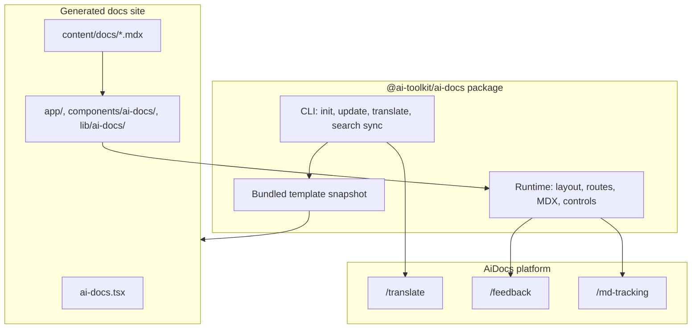

# Overview

AiDocs is a packaged documentation system built with Next.js, Fumadocs, and shared Vercel documentation patterns. Use it to create a docs site with local content files and package-managed runtime features.

  Help me understand this AiDocs project. Explain how the `@ai-toolkit/ai-docs` package, local adapter files, and `content/docs` folder work together, then suggest the first files I should edit for my documentation site.

## How AiDocs works

AiDocs has three main parts:

- `@ai-toolkit/ai-docs`: The npm package that provides the CLI, runtime components, route helpers, MDX components, page actions, and bundled template.
- Local adapter files: The files in your generated project that connect your configuration, content source, routes, and UI customization to the package.
- Platform services: Hosted endpoints at `geistdocs.com` for optional translation, feedback, and markdown tracking features.

## What you edit

Most projects start by editing these files:

- `content/docs`: Write and organize your docs.
- `content/docs/meta.json`: Control sidebar order and groups.
- `ai-docs.tsx`: Configure the logo, nav, GitHub repo, title, AI prompt, translations, and feature flags.
- `components/ai-docs/mdx-components.tsx`: Add or override MDX components.
- `app/[lang]/docs/[[...slug]]/page.tsx`: Configure docs page behavior, such as custom render hooks.
- `proxy.ts`: Add site-specific request logic before or after package-managed markdown negotiation.

## What the package owns

The package owns shared behavior such as docs rendering, page actions, search, Ask AI, markdown routes, `llms.txt`, and reusable MDX components. Updating `@ai-toolkit/ai-docs` gives your project package-level fixes and features without overwriting user-owned adapter files.

Ask AI uses AI SDK v6 through package-managed client and server code. Generated projects include `ai` v6 and `@ai-sdk/react` v3 so the package chat UI and `createChatRoute` use the supported AI SDK APIs.

Advanced projects can use package APIs for versioned docs, multiple content sources, custom page metadata, and custom proxy hooks while keeping runtime behavior in `@ai-toolkit/ai-docs`.

## Included features

- MDX documentation with custom components
- Local content in `content/docs`
- Search and Ask AI
- Optional Mixedbread semantic retrieval for Ask AI
- Page actions, including feedback, copy page, open in chat, and edit on GitHub
- Agent-readiness metadata with `/agents.md` and `/.well-known/mcp.json`
- Raw Markdown routes for AI tools
- `llms.txt`
- Versioned docs and multiple content sources
- Proxy hooks for custom request logic
- RSS feed
- Theme-aware images
- Internationalized routes
- CLI commands for init, update, translation, and Mixedbread search sync

## Next steps

- Follow [Getting Started](/docs/getting-started) to create and run a project.
- Read [Migration guide](/docs/migration) to move an existing docs site to package-backed AiDocs.
- Read [Configuration](/docs/configuration) to customize the generated site.
- Read [Versioned docs](/docs/versioned-docs) to configure multiple docs versions.
- Read [Proxy and markdown routes](/docs/proxy) to add custom request logic.
- Read [Syntax](/docs/syntax) to write content with MDX components.
