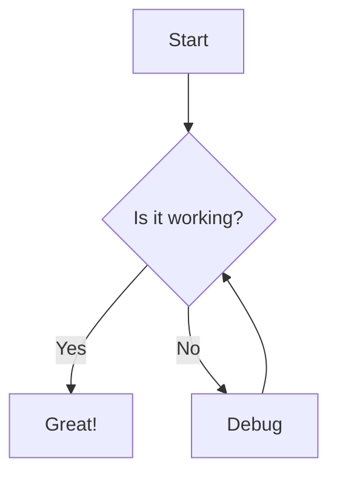
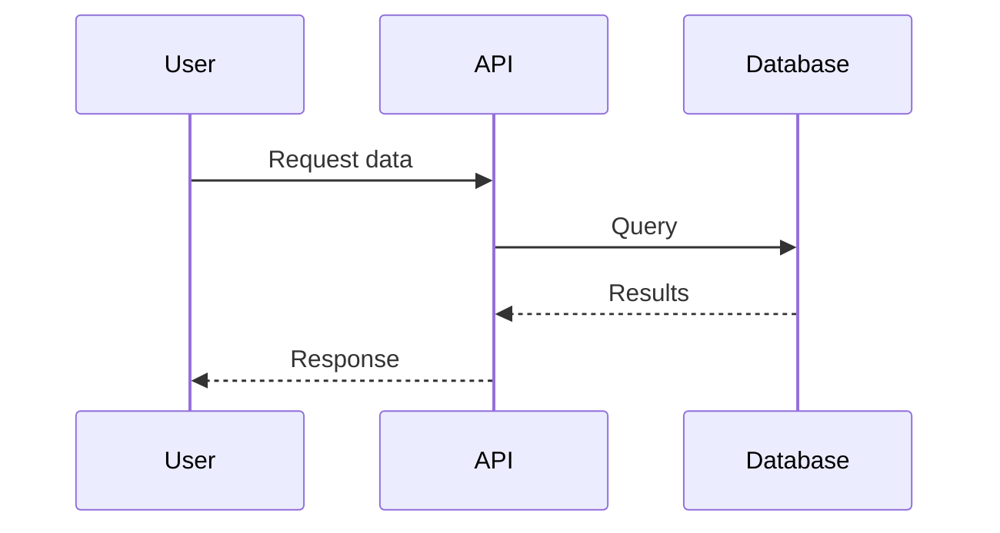
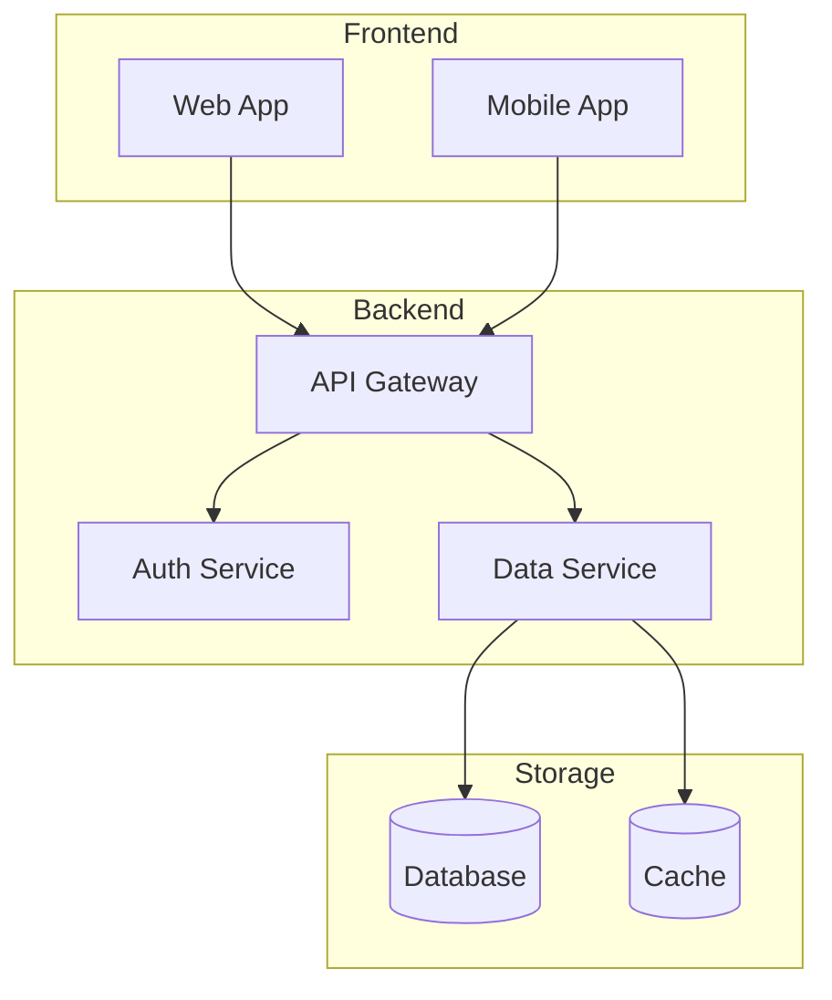

AiDocs 支持 MDX，这是 Markdown 的超集，允许您在文档中使用 JSX 组件。本指南涵盖所有可用的格式选项。

## Frontmatter

每个 MDX 文件应在顶部包含 frontmatter：

```yaml
---
title: Page Title
description: A brief description of the page content
navTitle: Short page title
---
```

`title` 属性为必填，用于页面标题、元数据和默认导航标签。可选的 `navTitle` 可以设置较短的导航标签，而不更改页面标题。`description` 用于 SEO 和页面预览。

## Basic Markdown

### 文本格式

您可以使用标准 Markdown 语法来设置文本样式：

- **加粗文本** 使用 `**double asterisks**`
- _斜体文本_ 使用 `*single asterisks*`
- ~~删除线~~ 使用 `~~double tildes~~`
- `行内代码` 使用 `` `backticks` ``

### 标题

使用 `#` 符号创建标题：

```text
# Heading 1

## Heading 2

### Heading 3

#### Heading 4

##### Heading 5

###### Heading 6
```

标题会自动生成锚点链接，便于导航和深度链接。

### 列表

使用 `-`、`*` 或 `+` 创建无序列表：

- 第一项
- 第二项
  - 嵌套项
  - 另一个嵌套项
- 第三项

使用数字创建有序列表：

1. 第一步
2. 第二步
3. 第三步

### 引用

使用 `>` 创建引用：

> 这是一个引用。您可以用它来突出重要信息或引用外部来源。

### 链接

使用 `[text](url)` 创建链接：

- [外部链接](https://vercel.com)
- [内部链接](/docs/getting-started)

### 图片

使用 `` 添加图片：

```md

```

## GitHub Flavored Markdown

AiDocs 支持 GFM 扩展，包括表格、任务列表和自动链接。

### 表格

使用竖线和短横线创建表格：

```md
| Feature  | Description       | Status    |
| -------- | ----------------- | --------- |
| Markdown | Basic formatting  | Supported |
| GFM      | GitHub extensions | Supported |
| MDX      | JSX in Markdown   | Supported |
```

渲染为：

| Feature  | Description       | Status    |
| -------- | ----------------- | --------- |
| Markdown | Basic formatting  | Supported |
| GFM      | GitHub extensions | Supported |
| MDX      | JSX in Markdown   | Supported |

### 任务列表

创建交互式任务列表：

```md
- [x] Completed task
- [ ] Incomplete task
- [ ] Another task to do
```

渲染为：

- [x] 已完成任务
- [ ] 未完成任务
- [ ] 另一个待办任务

### 自动链接

URL 会自动转换为可点击链接：

```md
https://vercel.com
```

渲染为：

https://vercel.com

## 代码块

围栏代码块支持多种语言的语法高亮。

### 基本语法高亮

在开头的反引号后指定语言：

````md
```typescript
const greet = (name: string): string => {
  return `Hello, ${name}!`;
};
```
````

渲染为：

```typescript
const greet = (name: string): string => {
  return `Hello, ${name}!`;
};
```

### 代码块标题

使用 `title` 属性为代码块添加标题：

````md
```tsx title="components/button.tsx"
export const Button = ({ children }) => {
  return <button type="button">{children}</button>;
};
```
````

渲染为：

```tsx title="components/button.tsx"
export const Button = ({ children }) => {
  return <button type="button">{children}</button>;
};
```

### 行号

通过添加 `lineNumbers` 属性来显示行号：

````md
```typescript lineNumbers
const numbers = [1, 2, 3, 4, 5];
const doubled = numbers.map((n) => n * 2);
console.log(doubled);
```
````

渲染为：

```typescript lineNumbers
const numbers = [1, 2, 3, 4, 5];
const doubled = numbers.map((n) => n * 2);
console.log(doubled);
```

您也可以使用 `lineNumbers=10` 指定起始行号：

```typescript lineNumbers=10
const config = {
  theme: "dark",
  language: "en",
};
```

### 行高亮

使用 `[!code highlight]` 注释高亮特定行：

````md
```typescript
const config = {
  theme: "dark", // [ !code highlight]
  language: "en",
};
```
````

在使用此语法时，请移除 `!` 前的空格。渲染为：

```typescript
const config = {
  theme: "dark", // [!code highlight]
  language: "en",
};
```

### 单词高亮

使用 `[!code word:term]` 高亮特定单词：

````md
```typescript
// [ !code word:config]
const config = {
  theme: "dark",
};

console.log(config);
```
````

在使用此语法时，请移除 `!` 前的空格。渲染为：

```typescript
// [!code word:config]
const config = {
  theme: "dark",
};

console.log(config);
```

### 差异语法

使用 `[!code ++]` 和 `[!code --]` 显示添加和删除：

````md
```typescript
const config = {
  theme: "light", // [ !code --]
  theme: "dark", // [ !code ++]
  language: "en",
};
```
````

在使用此语法时，请移除 `!` 前的空格。渲染为：

```typescript
const config = {
  theme: "light", // [!code --]
  theme: "dark", // [!code ++]
  language: "en",
};
```

### 焦点行

使用 `[!code focus]` 强调特定行：

````md
```typescript
const numbers = [1, 2, 3, 4, 5];
const sum = numbers.reduce((a, b) => a + b, 0); // [ !code focus]
console.log(sum);
```
````

在使用此语法时，请移除 `!` 前的空格。渲染为：

```typescript
const numbers = [1, 2, 3, 4, 5];
const sum = numbers.reduce((a, b) => a + b, 0); // [!code focus]
console.log(sum);
```

## Mermaid 图表

使用 Mermaid 语法创建图表和流程图。

### 流程图

````md

````

渲染为：


### 时序图

````md

````

渲染为：


### 架构图

````md

````

渲染为：


