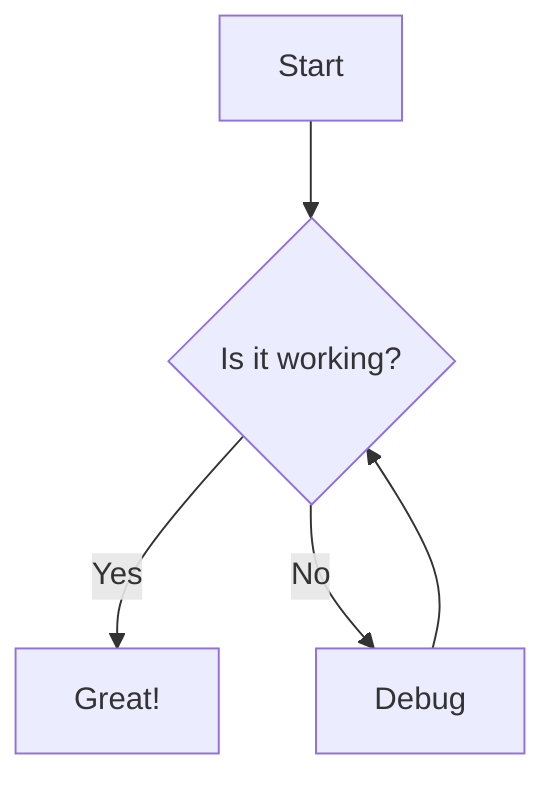
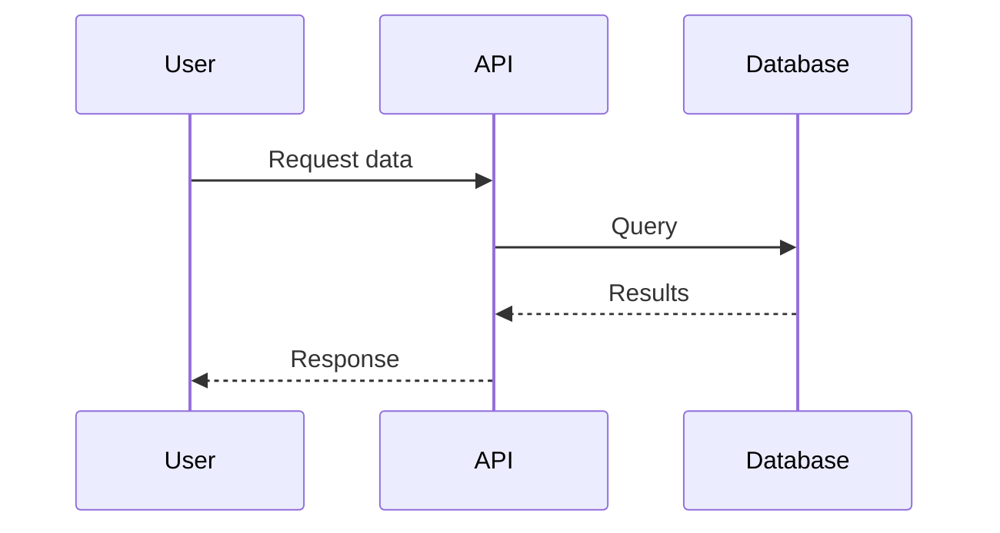
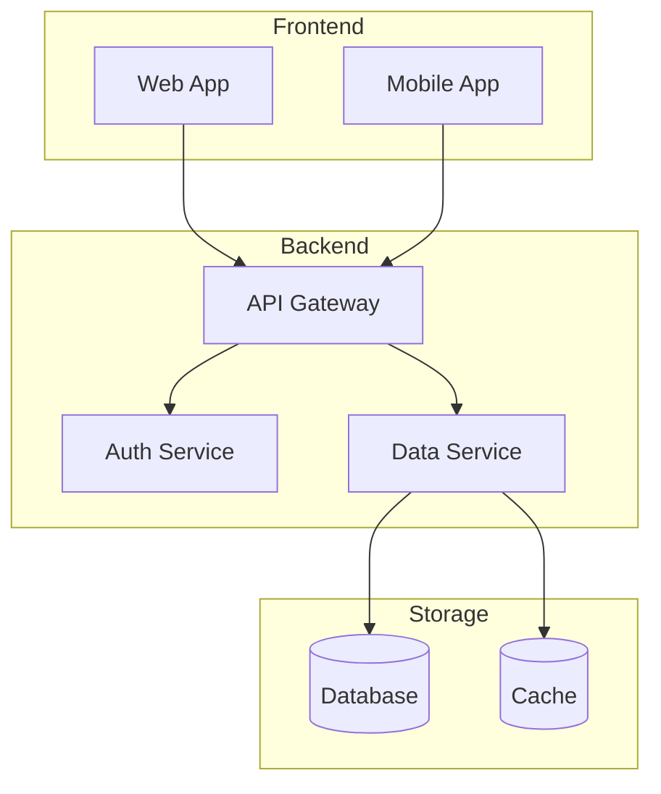

AiDocs supports MDX, a superset of Markdown that allows you to use JSX components within your documentation. This guide covers all the formatting options available.

<CopyPrompt text="Help me write a AiDocs MDX page. Use this page as a syntax reference and create an example page with frontmatter, headings, links, a code block, a Callout, and a CopyPrompt component.">
  Help me write a AiDocs MDX page. Use this page as a syntax reference and create an example page with frontmatter, headings, links, a code block, a `Callout`, and a `CopyPrompt` component.
</CopyPrompt>

## Frontmatter

Every MDX file should include frontmatter at the top:

```yaml
---
title: Page Title
description: A brief description of the page content
navTitle: Short page title
badge: Beta
---
```

The `title` property is required and is used for the page heading, metadata, and default navigation label. Set the optional `navTitle` when navigation needs a shorter label without changing the page heading. The `description` is used for SEO and page previews. The optional `badge` appears beside the page label in desktop and mobile sidebar navigation. Badge labels that match an uppercase HTTP method (`GET`, `POST`, `PUT`, `PATCH`, `DEL`, or `DELETE`) render with a method-specific color. See [Configure sidebar navigation](/docs/guides/nested-navigation) for the full color mapping.

## Basic Markdown

### Text Formatting

You can style text using standard Markdown syntax:

- **Bold text** with `**double asterisks**`
- _Italic text_ with `*single asterisks*`
- ~~Strikethrough~~ with `~~double tildes~~`
- `Inline code` with `` `backticks` ``

### Headings

Use `#` symbols to create headings:

```text
# Heading 1

## Heading 2

### Heading 3

#### Heading 4

##### Heading 5

###### Heading 6
```

Headings automatically generate anchor links for navigation and deep linking.

### Lists

Create unordered lists with `-`, `*`, or `+`:

- First item
- Second item
  - Nested item
  - Another nested item
- Third item

Create ordered lists with numbers:

1. First step
2. Second step
3. Third step

### Blockquotes

Use `>` to create blockquotes:

> This is a blockquote. You can use it to highlight important information or quotes from external sources.

### Links

Create links with `[text](url)`:

- [External link](https://vercel.com)
- [Internal link](/docs/getting-started)

### Images

Add images with ``:

```md

```

## GitHub Flavored Markdown

AiDocs supports GFM extensions including tables, task lists, and autolinks.

### Tables

Create tables using pipes and dashes:

```md
| Feature  | Description       | Status    |
| -------- | ----------------- | --------- |
| Markdown | Basic formatting  | Supported |
| GFM      | GitHub extensions | Supported |
| MDX      | JSX in Markdown   | Supported |
```

This renders as:

| Feature  | Description       | Status    |
| -------- | ----------------- | --------- |
| Markdown | Basic formatting  | Supported |
| GFM      | GitHub extensions | Supported |
| MDX      | JSX in Markdown   | Supported |

### Task Lists

Create interactive task lists:

```md
- [x] Completed task
- [ ] Incomplete task
- [ ] Another task to do
```

This renders as:

- [x] Completed task
- [ ] Incomplete task
- [ ] Another task to do

### Autolinks

URLs are automatically converted to clickable links:

```md
https://vercel.com
```

This renders as:

https://vercel.com

## Code Blocks

Fenced code blocks support syntax highlighting for many languages.

### Basic Syntax Highlighting

Specify the language after the opening backticks:

````md
```typescript
const greet = (name: string): string => {
  return `Hello, ${name}!`;
};
```
````

This renders as:

```typescript
const greet = (name: string): string => {
  return `Hello, ${name}!`;
};
```

### Titles

Add a title to your code block with the `title` attribute:

````md
```tsx title="components/button.tsx"
export const Button = ({ children }) => {
  return <button type="button">{children}</button>;
};
```
````

This renders as:

```tsx title="components/button.tsx"
export const Button = ({ children }) => {
  return <button type="button">{children}</button>;
};
```

### Framework icons

Append `#<framework>` to the title to show a framework logo instead of the
language icon. The suffix is stripped from the displayed title. Supported
values are `#next` / `#nextjs` and `#svelte` / `#sveltekit`:

````md
```ts title="flags.ts#next"
import { flag } from 'flags/next';
```

```ts title="flags.ts#svelte"
import { flag } from 'flags/sveltekit';
```
````

This renders as:

```ts title="flags.ts#next"
import { flag } from 'flags/next';
```

```ts title="flags.ts#svelte"
import { flag } from 'flags/sveltekit';
```

### Line Numbers

Display line numbers by adding the `lineNumbers` attribute:

````md
```typescript lineNumbers
const numbers = [1, 2, 3, 4, 5];
const doubled = numbers.map((n) => n * 2);
console.log(doubled);
```
````

This renders as:

```typescript lineNumbers
const numbers = [1, 2, 3, 4, 5];
const doubled = numbers.map((n) => n * 2);
console.log(doubled);
```

### Line Highlighting

Highlight specific lines using the `[!code highlight]` comment:

````md
```typescript
const config = {
  theme: "dark", // [ !code highlight]
  language: "en",
};
```
````

Remove the space before `!` when using this syntax. This renders as:

```typescript
const config = {
  theme: "dark", // [!code highlight]
  language: "en",
};
```

### Word Highlighting

Highlight specific words with `[!code word:term]`:

````md
```typescript
// [ !code word:config]
const config = {
  theme: "dark",
};

console.log(config);
```
````

Remove the space before `!` when using this syntax. This renders as:

```typescript
// [!code word:config]
const config = {
  theme: "dark",
};

console.log(config);
```

### Diff Syntax

Show additions and deletions with `[!code ++]` and `[!code --]`:

````md
```typescript
const config = {
  theme: "light", // [ !code --]
  theme: "dark", // [ !code ++]
  language: "en",
};
```
````

Remove the space before `!` when using this syntax. This renders as:

```typescript
const config = {
  theme: "light", // [!code --]
  theme: "dark", // [!code ++]
  language: "en",
};
```

### Focus Lines

Draw attention to specific lines with `[!code focus]`:

````md
```typescript
const numbers = [1, 2, 3, 4, 5];
const sum = numbers.reduce((a, b) => a + b, 0); // [ !code focus]
console.log(sum);
```
````

Remove the space before `!` when using this syntax. This renders as:

```typescript
const numbers = [1, 2, 3, 4, 5];
const sum = numbers.reduce((a, b) => a + b, 0); // [!code focus]
console.log(sum);
```

## Mermaid Diagrams

Create diagrams and flowcharts using Mermaid syntax.

### Flowcharts

````md

````

This renders as:


### Sequence Diagrams

````md

````

This renders as:


### Architecture Diagrams

````md

````

This renders as:


